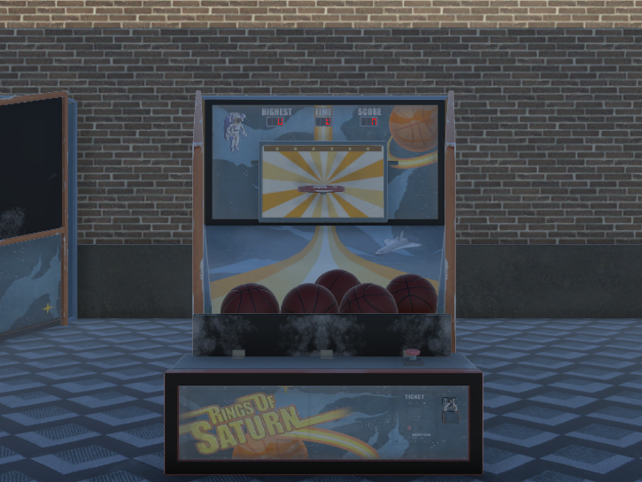

# Recréation de Rings of Saturn Basketball en Réalité Virtuelle (Quest 2)

Ce projet a pour but de recréer le célèbre mini-jeu d'arcade *Rings of Saturn Basketball* du mode zombie de *Call of Duty: Infinite Warfare*, mais en réalité virtuelle, spécialement conçu pour être joué sur l'Oculus Quest 2.

## Objectifs du projet

- **Recréer l'expérience arcade** : Transposer le mini-jeu d'arcade *Rings of Saturn Basketball* dans un environnement VR immersif.
- **Compatibilité VR** : Développement et optimisation pour le casque Oculus Quest 2, avec une prise en charge complète des contrôleurs pour une expérience de tir intuitive.
- **Immersion et interactivité** : Offrir une immersion totale en VR avec des mécaniques de jeu précises pour lancer le ballon et interagir avec l'environnement.

## Fonctionnalités principales

- **Simulation de tir en VR** : Mécanique de tir réaliste basée sur les mouvements des contrôleurs Oculus Quest 2.
- **Environnement en réalité virtuelle** : Graphismes et ambiance arcade fidèles à l'expérience d'origine, recréant le visuel rétro-futuriste de *Rings of Saturn Basketball*.
- **Score et progression** : Système de comptabilisation des points pour suivre les performances des joueurs dans une session de jeu.

## Technologies utilisées

- **Unity** : Moteur de jeu utilisé pour développer et optimiser l'expérience VR.
- **Oculus SDK** : Intégration du SDK Oculus pour la gestion des interactions en réalité virtuelle et la compatibilité avec Quest 2.
- **C#** : Langage de programmation utilisé pour la logique du jeu et les interactions VR.

